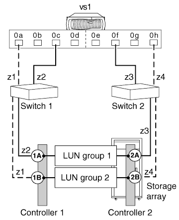

= Stand-alone system with two 2-port array LUN groups
:icons: font
:imagesdir: ../media/

[.lead]
In a stand-alone ONTAP system that is in a fabric-attached simple configuration, each FC initiator port pair present on the ONTAP system accesses a separate array LUN group.

This configuration is supported for use with all storage arrays listed in the Interoperability Matrix as supported for the release of ONTAP running on your system.

The following illustration shows fabric-attached simple configuration:

*Related information*

https://mysupport.netapp.com/matrix[NetApp Interoperability Matrix Tool]
