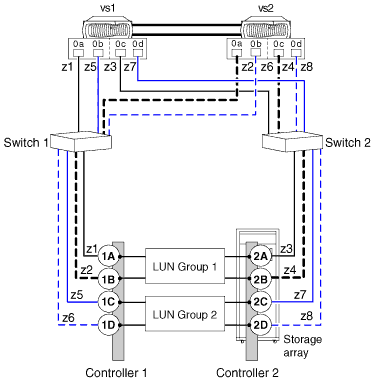

= Two 4-port array LUN group configuration
:icons: font
:imagesdir: ../media/

[.lead]
In this configuration, each ONTAP FC initiator port pair accesses a separate array LUN group. The zoning is a single ONTAP FC initiator to a single array target port.

This configuration is supported for use with all storage arrays listed in the Interoperability Matrix as supported for the release of ONTAP running on your system.

The following illustration shows a block diagram of this configuration:

*Related information*

https://mysupport.netapp.com/matrix[NetApp Interoperability Matrix Tool]
