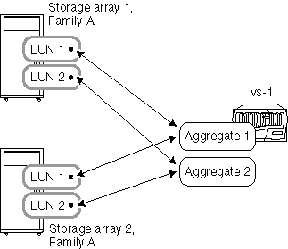

= Aggregate rules when the storage arrays are from the same family
:icons: font
:imagesdir: ../media/

[.lead]
Specific rules apply to how you can lay out array LUNs in aggregates when the storage arrays are from the same storage array vendor and model family.

If your storage arrays are from the same vendor, the rules for adding array LUNs to aggregates are as follows:

* You can mix array LUNs from the storage arrays in the same aggregate if the storage arrays are in the same family.
* You can separate the array LUNs into different aggregates.

The following examples show some options for laying out array LUNs in aggregates when the storage arrays behind an ONTAP system are in _the same vendor family_.

[NOTE]
====
For simplicity, the illustrations show only two storage arrays; your deployment can include more storage arrays.
====

== Example 1: Add LUNs from all storage arrays to a single aggregate

As shown in the following illustration, you can create one aggregate, then add all LUNs from all the storage arrays in the same family to the same aggregate:

image::../media/luns_assigned_to_same_aggr_same_family.gif[This graphic is described by the surrounding text.]

== Example 2: Distribute and mix LUNs from the storage arrays over multiple aggregates

As shown in the following illustration, you can create multiple aggregates, then distribute and mix the array LUNs from the different storage arrays in the same family over the aggregates:

[NOTE]
====
This example is not supported if you have storage arrays of the same model and one has Fibre Channel drives and the other storage array has SATA drives. In that case, those storage arrays are not considered to be in the same family.
====
