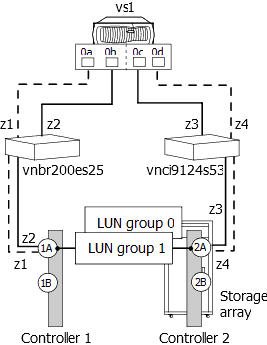

= Duplicate LUN IDs on a target port
:icons: font
:imagesdir: ../media/

[.lead]
Each array LUN on the same storage array target port must have a unique LUN ID. The `storage errors show` output identifies the LUNs that are presented with the same LUN ID on the same target port.

== Storage errors show message

----

NAME (UID), port WWPNx: LUN x occurs more than once.  LUNs cannot be reused on the same array target port.
----

== Explanation

The usual cause of duplicate LUN IDs on a target port is a zoning error. An administrator puts the FC initiators of ONTAP systems into different host groups to create multiple LUN groups on a storage array, but then makes a zoning mistake that allows the initiators in the different host groups to access the same target port.

When this type of zoning error is made, `storage array config show` output shows two LUN groups with the same target ports.

== Problem scenario

The administrator wants to map four LDEVs (a, b, c, and d) for ONTAP use, two LDEVs in each of two LUN groups. For this scenario, assume that the storage array presents LDEVs to initiator ports without considering the target port by which the initiator accesses the storage arrays; that is, the host groups are _not_ specific to a target port. Zoning must be used to create LUN groups by controlling which target ports are accessed by each initiator.

[NOTE]
====
For some storage arrays, such as HP EVA, host groups are the same for all target ports. For other storage arrays, such as Hitachi, host groups are specific to a target port.
====

The administrator correctly sets up two host groups, as follows, so that there are two LUN groups:
[options="header"]
|===
| Host group| FC initiators in the host group| LDEVs and associated LUN IDs
a|
1
a|
0a0c

a|
LDEV a/LUN 1LDEV b/LUN 2

a|
2
a|
0b 0d

a|
LDEV c/LUN 1LDEV d/LUN 2

|===
The zoning should be set up as follows:

* The initiators in host group 1, 0a and 0c, should be zoned to the target port pair 1A and 2A.
* The initiators in host group 2, 0b and 0d, should be zoned to the target port pair 1B and 2B.

Notice in the preceding table that LDEV a and LDEV c both have the same LUN ID (L1). Likewise, LDEV b and LDEV d both have the same LUN ID (L2). If the zoning is set up correctly, this duplication of LUN IDs is not a problem because reuse of LUN IDs on different target ports is supported.

The problem in this scenario is that some initiators are placed in the wrong zone when the zoning is configured, as shown in the following table:
[options="header"]
|===
| Zone| ONTAP system|| Storage array|
5+a|
Switch vnbr200es25
a|
z1
a|
vs1
a|
Port 0a
a|
Controller 1
a|
Port 1A
a|
z2
a|
vs1
a|
Port 0b
a|
Controller 1
a|
Port 1A (instead of 1B)
5+a|
Switch vnci9124s53
a|
z3
a|
vs1
a|
Port 0c
a|
Controller 2
a|
Port 2A
a|
z4
a|
vs1
a|
Port 0d
a|
Controller 2
a|
Port 2A (instead of 2B)
|===
The following illustration shows the result of the zoning error:

As you can see from the illustration, two LUN groups are created. However, because of the zoning error, LUN group 0 and LUN group 1 are on the same target port pair (1A and 2A), instead of one LUN group being on each target port pair.

The following `storage array config show` output for this example shows two LUN groups. The problem is that the two LUN groups have the same target ports.

----

vs1::> storage array config show

       LUN    LUN
Node  Group  Count  Array Name   Array Target Ports     Switch Port   Initiator
----- ----- ------- -----------  -------------------    ----------    ---------

 vs1    0       2   DGC_RAID5_1  20:1A:00:a0:b8:0f:ee:04  vnbr200es25:5  0a
                                 20:2A:00:a0:b8:0f:ee:04  vnci9124s53:6  0c
        1       2   DGC_RAID5_1  20:1A:00:a0:b8:0f:ee:04  vnbr200es25:5  0b
                                 20:2A:00:a0:b8:0f:ee:04  vnci9124s53:6  0d

Warning: Configuration were errors detected.  Use 'storage errors show' for detailed information.
----

The following `storage errors show` output for this example identifies the LUNs with the problem:

----

vs1::> storage errors show

Disk: EMC-1.1
UID: UID-a
----------
EMC-1.1 (UID-a), port WWPN1: LUN 1 occurs more than once.  LUNs cannot be reused on the same array target port.

Disk: EMC-1.2
UID: UID-b
----------
EMC-1.2 (UID-b), port WWPN1: LUN 2 occurs more than once.  LUNs cannot be reused on the same array target port.

Disk: EMC-1.3
UID: UID-c
----------
EMC-1.3 (UID-c), port WWPN2: LUN 1 occurs more than once.  LUNs cannot be reused on the same array target port.

Disk: EMC-1.4
UID: UID-d
----------
EMC-1.4 (UID-d), port WWPN2: LUN 2 occurs more than once.  LUNs cannot be reused on the same array target port.
----

From this `storage errors show` example you can see that the UIDs of all four LDEVs are shown, but there are only two unique LUN IDs, LUN 1 and LUN 2. instead of four.

== Troubleshooting and problem resolution

The storage array administrator must fix the zoning so that the initiators in different host groups do not have access to the same target port.

. In `storage array config` output, look for initiators that are talking to the same target port.
. Enter the following command to view the details of the error: `storage errors show`
. Determine the LDEV for which the LUN IDs are duplicated.
. For each target port on controller 1 that has multiple initiators from the same ONTAP system mapped to it, change the zoning so that the two FC initiators are _not_ talking to the same target port.
+
You are performing this step because initiators in different host groups should not be in the same zone. You need to perform this step on one initiator at a time so that there is always a path to the array LUN.

. Repeat the procedure on controller 2.
. Enter `storage errors show` in ONTAP and confirm that the error has been fixed. ``
