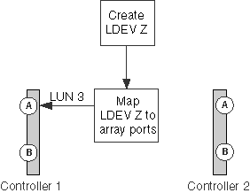

= Fewer than two paths to an array LUN
:icons: font
:imagesdir: ../media/

[.lead]
Common reasons for fewer than two paths to an array LUN are a mapping error, a zoning error, or a cable dropping out. The `storage errors show` output identifies array LUNs with only a single path.

ONTAP requires redundant paths to an array LUN so that access to the LUN is maintained if a device fails. Two paths must exist to each array LUN.

== Storage errors show message

----

NAME (UID):  This Array LUN is only available on one path.  Proper configuration requires two paths.
----

== Explanation

Reasons you see fewer than two paths to an array LUN include the following:

* The LDEV is mapped on only one storage array port.
* The second path to the array LUN is not zoned.
* There is a problem with the host group mapping.
* There is a problem with switch connections.
* The cable dropped out.
* SFPs failed on the adapter.

[NOTE]
====
If a path drops out on a running system, an EMS message is generated.
====

== Problem scenario

For this example of a mapping error, assume that the storage administrator created a new LDEV Z. The administrator mapped LDEV Z as LUN ID 3 to target port 1A. However, the administrator did not map the LDEV to target port 2A, as the following illustration shows. The result is only one path to the array LUN.

When this error is made, the `storage array config show` output shows only one path to the LUN, as the following example shows.

----

mysystem1::> storage array config show
           LUN     LUN
Node       Group   Count  Array Name    Array Target Ports      Switch Port   Initiator
-------   -------  -----  ----------   -------------------      -----------    ---------
mysystem1a    0      1    DGC_RAID5_1  20:1A:00:a0:b8:0f:ee:04  vnbr20es25:5   0a

Warning: Configuration errors were detected.  Use 'storage errors show' for detailed information.
----

The `storage errors show` command provides the details you need to determine which LUN has fewer than two paths.

----

mysystem1a::> storage errors show
Disk: EMC-1.2
UID: 600508B4:000B6314:00008000:00200000:00000000:00000000:00000000:...
--------------------
EMC-1.2 (600508b4000b63140000800000200000): This array LUN is only available on one path. Proper configuration requires two paths.
----

[NOTE]
====
The UID for this example is 600508B4:000B6314:00008000:00200000:00000000:00000000:00000000:00000000:00000000:00000000. It is truncated because of space.
====

== Troubleshooting and problem resolution

Looking at both the `storage array config show` output and the storage errors show output is helpful when troubleshooting fewer than two paths to an array LUN.

. Review the `storage errors show` output to obtain the serial number of the array LUN that is available on only one path.
. Review the `storage array config show` output to try to isolate the cause of the problem.
+
[options="header"]
|===
| If the `storage array config show` output shows...| The cause is most likely...
a|
Other array LUNs
a|
A mapping error
a|
No other array LUNs
a|
A cabling error, zoning error, or hardware issue
|===

. If the cause is a mapping error, have the storage array administrator map the identified array LUN to two redundant storage array ports.
. If the cause seems to be a problem other than mapping, check zoning, host group mapping, cabling, and connectivity.
. After you fix the problem, run `storage array config show` again to confirm that the error is fixed.
