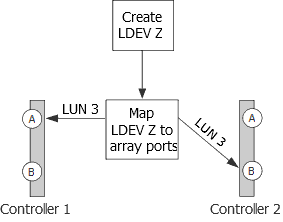

= Reasons for more array LUN groups than expected
:icons: font
:imagesdir: ../media/

[.lead]
When validating your configuration, you should check the `storage array config show` output to ensure that the number of LUN groups is what you intended. The most common reason for extra array LUN groups is that the LDEV is spanning target port pairs.

== Explanation

Common reasons why you would see more LUN groups than expected are as follows:

* An LDEV is not mapped to a redundant target port pair.
+
The most common cause of an extra LUN group is that the LDEV is spanning path pairs. An LDEV is said to be _spanning path pairs_ if matching LUN IDs for the LDEV are not presented to a redundant target port pair on the storage array.

[NOTE]
====
On many storage arrays, it is not possible to present an LDEV to target ports that are not redundant if you follow the conventional process for creating and mapping LDEVs.
====

* ONTAP is trying to balance the load over the target ports during migration of array LUNs from one LUN group to another.
+
In this case, the LDEV spanning path pairs is a transitional state.

* Too many connections are set up.

ONTAP can run with a single array LUN group or multiple array LUN groups. Therefore, ONTAP does not consider any number of LUN groups to be a misconfiguration. However, multiple LUN groups are not supported for all storage arrays in all ONTAP releases. During configuration planning, you should check the information in the Interoperability Matrix to verify whether multiple array LUN groups are supported for the storage arrays used in your ONTAP configuration.

== Problem scenario

Assume that there are two existing LUN groups, LUN group 0 and LUN group 1. LUN group 0 has two array LUNs and LUN group 1 has three array LUNs. The administrator created a new LDEV Z, intending to add LUN 3 to LUN group 0. The administrator mapped LDEV Z as LUN 3 on two storage array ports. However, the ports to which LUN 3 are mapped, storage array ports 1A and 2B, are not a redundant target port pair, as the following illustration shows.

The result of this error is that a third, unintended LUN group is created (Group 2), as the following example shows:

----

mysystem1::> storage array config show

          LUN   LUN
Node      Group Count  Array Name  	Array Target Ports     	Switch Port  	Initiator
-------   ----- ------ ----------- 	-------------------    	-----------  	---------

mysystem1  0     3     DGC_RAID5_1  20:1A:00:a0:b8:0f:ee:04  vnbr20es25:5    0a
                                   	20:2A:00:a0:b8:0f:ee:04  vnci9124s53:6   0c
           1     3     DGC_RAID5_1  20:1B:00:a0:b8:0f:ee:04  vnbr20es25:7    0b
                                   	20:2B:00:a0:b8:0f:ee:04  vnci9124s53:8   0d
           2     1     DGC_RAID5_1  20:1A:00:a0:b8:0f:ee:04  vnbr20es25:5    0a
                                   	20:2B:00:a0:b8:0f:ee:04  vnci9124s53:8   0d
----

You can infer from the information in the Array Target Ports column for Groups 0 and 1 that the paths to the array target ports are redundant. Group 0 goes to target ports 1A and 2A, a target port pair. Group 1 goes to 1B and 2B, a different target port pair.

However, the information in the Array Target Ports column for Group 2 suggests that the paths are not redundant. One path goes to target port 1A and the other goes to target port 2B. This is not a redundant target port pair; the array LUN is spanning LUN groups. The array LUN should have been mapped to either 1A and 2A or 1B and 2B.

Because the ONTAP system can run with an LDEV spanning path pairs, the message instructing you to run `storage errors show` does not appear after you run the `storage array config show` command. However, this is not a best practice configuration.

== Resolving the issue

. Wait for one minute, then run `storage array config show` again to see whether the extra LUN group is still shown in the `storage array config show` output.
 ** If the extra LUN group is no longer in the output, you can conclude that the issue was transitional.
 ** If the extra LUN group still appears in the output, the storage array administrator must remap the LDEV, as documented in the next steps.
+
You need to maintain redundancy while fixing this problem. This procedure instructs you to map the LDEV to the correct target port _before_ removing the mapping to the incorrect target port. Redundancy is maintained in this case because you are increasing the number of paths to three, temporarily, instead of decreasing the number of paths to one while you are fixing the problem.
. Decide which of the inconsistent target ports should be remapped.
. On the storage array, map the LDEV to the new (correct) target port.
. In ONTAP, run `storage array config show` to confirm that three paths are shown.
. Remove the incorrect mapping.
. Wait for one minute while ONTAP discovers the LUN.
. In ONTAP, run `storage array config show` again to make sure that the extra LUN group is gone.

*Related information*

https://mysupport.netapp.com/matrix[NetApp Interoperability Matrix Tool]
