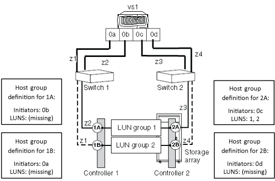

= Reasons for no LUNs in the array LUN group
:icons: font
:imagesdir: ../media/

[.lead]
When validating the back-end configuration, you should check the `storage array config show` output to determine whether LUNs are shown in the LUN groups. When the `storage array config show` output shows no LUNs in an array LUN group, ONTAP can see the target port on the fabric but the target port is not presenting array LUNs to ONTAP.

There are a variety of reasons why a target port might not present array LUNs to ONTAP (an open target port). The reasons for an open target port can differ between different storage arrays. In addition, the ways to handle the open target port issues differ with storage arrays. For all storage arrays, troubleshooting the cause of an open target port should include checking the storage array configuration, including the host group configuration.

For example, the cause could be an _empty host group_, which presents itself to ONTAP as an open target port. With an empty host group, the host group defines the FC initiator and target ports, but it does not list any array LUNs (that is, the host group is empty).
[NOTE]
====
The operation of the ONTAP systems is not impacted by an empty host group.
====

The following illustration represents an open port target port situation and an empty host group situation. (A stand-alone ONTAP system is used in the illustration for simplicity.)

The open target port is caused by missing LUN IDs in the host group definition for storage controller 1A. In the host group definition for storage controller 1A, the FC initiator 0b is zoned into the target port and there is a host group defined for FC initiator port 0b, but there are no LUN IDs in the host group. As the illustration shows, the host group definition for storage controller 2A includes both initiators and LUNs.

The empty host group is caused by array LUNs not getting listed in the host group definition for storage controllers 1B and 2B. The FC initiators 0a and 0d are zoned into the target ports but no LUNs are shown.

The following example shows the `storage array config show` output for the illustrated situations where the ONTAP system is zoned to the storage array but there are no LUNs in the host group definitions for the storage controller 1A, resulting in an open target port. The controllers 1B and 2B do not have LUNs in their respective host group definitions, resulting in an empty host group.

In the output for the illustrated situations, the FC initiators 0a, 0b, and 0d show no LUNs in the LUN count field. For the FC initiator 0c, two LUNs are shown in LUN group1.

----
cluster-1::> storage array config show
          LUN   LUN
Node      Group Count  Array Name       Array Target Port   Initiator
--------- ----- -----  ------------     ------------------- ---------
vs1
           0     2     EMC_SYMMETRIX_1  50060480000001b0       0c

           1     0     EMC_SYMMETRIX_1  50060480000001a0       0b

           2     0     EMC_SYMMETRIX_1  50060480000001b1       0a

                 0     EMC_SYMMETRIX_1  50060480000001a1       0d

4 entries were displayed.
----

[NOTE]
====
From the output you can determine that the problem is not due to missing FC initiators in the host group. If the FC initiators were missing from the host group, ONTAP would not be able to see the LUN groups having no LUNs.
====
